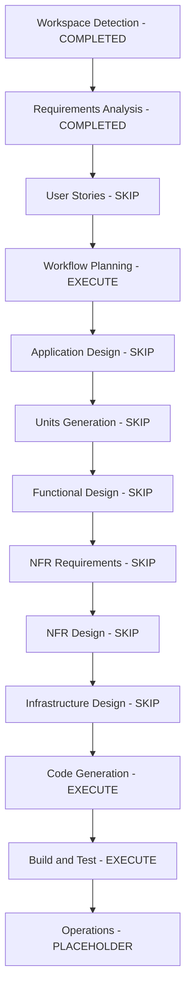

# Execution Plan

## Detailed Analysis Summary

The approved requirements define a small greenfield static web app: a dependency-free, single-page feedback collector using plain HTML, CSS, JavaScript, and browser `localStorage`.

The ticket is classified as `Single-Go`. The work can be implemented and reviewed as one unit because there is no backend, API, database, infrastructure, authentication, deployment dependency, or external integration.

## Change Impact Assessment

| Area | Impact |
|---|---|
| User-facing UI | New single-page feedback form and saved feedback list |
| Data model | Local browser-only feedback entry shape stored in `localStorage` |
| API | None |
| Backend | None |
| Database | None |
| Infrastructure | None |
| Security | Low; no secrets, no network calls, local browser storage only |
| Testing | Manual browser validation |

## Component Relationships

This is a greenfield workspace with no existing application components.

Planned static files:

- `index.html`: page structure, form fields, saved feedback list container
- `styles.css`: responsive accessible layout and UI states
- `script.js`: validation, localStorage persistence, render, delete, clear-all behavior

## Risk Assessment

Risk: Low

Rationale:

- no external dependencies
- no build pipeline
- no shared code or existing behavior to regress
- no remote data handling
- no authentication or authorization
- localStorage failure can be handled with a visible error path

## Workflow Visualization

## Phases To Execute

| Stage | Decision | Rationale |
|---|---|---|
| User Stories | Skip | Requirements and acceptance criteria are already explicit; no multi-persona or business workflow complexity. |
| Application Design | Skip | Static app with three simple files; component and service boundaries are obvious. |
| Units Generation | Skip | Jira classification is `Single-Go`; extra unit decomposition would add process overhead without reducing risk. |
| Functional Design | Skip | Behavior is simple CRUD-like local UI state and covered by requirements. |
| NFR Requirements | Skip | NFRs are already minimal and explicit: dependency-free, responsive, accessible labels, local-only data. |
| NFR Design | Skip | No separate NFR design is needed for this low-risk static app. |
| Infrastructure Design | Skip | No cloud, backend, deployment infrastructure, networking, or managed resources. |
| Code Generation | Execute | Create the static feedback collector files and implementation. |
| Build and Test | Execute | Validate the static app manually in a browser or equivalent local check. |
| Operations | Execute as placeholder | After Build and Test approval, ask whether to create a PR, then ask whether to deploy to Vercel. Neither action runs without explicit approval. |

## Branching And Handoff Notes

Before Code Generation starts, create or switch to a work branch from `main`.

Recommended branch: `feature/feedback-collector`

Operations handoff after Build and Test approval:

1. Ask whether to create a pull request.
2. Ask whether to deploy to Vercel.
3. Do not push, create a PR, or deploy without explicit approval.

## Package Change Sequence

No package-level changes are needed. There is no package manager, dependency manifest, build step, or generated output.

Implementation sequence:

1. Create `index.html`.
2. Create `styles.css`.
3. Create `script.js`.
4. Validate form behavior, persistence, delete, clear-all, error handling, and responsive layout.
5. Update Jira completion artifacts after implementation and validation.

## Estimated Timeline

Small single-session implementation.

## Success Criteria And Quality Gates

1. Requirements stay mapped to the accepted defaults.
2. App uses no external dependencies or network calls.
3. Feedback submission saves valid entries to `localStorage`.
4. Saved entries persist after refresh.
5. Entries render newest first.
6. Individual delete works.
7. Clear-all works.
8. Required rating and message validation works.
9. Optional email validation only runs when email is populated.
10. Message length is limited to 500 characters.
11. UI remains usable on mobile and desktop.
12. Completion log and final Jira comment artifacts are prepared after implementation.
